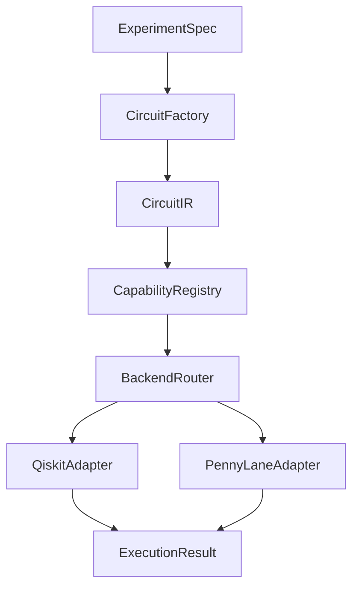

# Architecture and Extension Guide

> Version 1.2.5 contract: **everything at the framework boundary uses wire-major
> order**: statevector, probability, density-matrix, `sample`, and `counts`
> *outputs*; `STATE_PREP` amplitude *inputs*; and multi-qubit observable *matrices*.
> Bit `j` of an index (or a `counts` key) belongs to `wires[j]`, meaning that
> `wires[0]` is the most significant bit. Conversion to Qiskit's little-endian
> `qargs`/`initialize`/`get_counts` convention takes place inside the adapter.
> Analytical results report `shots=None`; finite-shot results report the actual
> execution shot count, and no path silently invents a shot count.
> Circuits and QNNs are configured from the same `BackendSpec` object.
>
> Noise comes from a single canonical Kraus definition (`qforge_ai.noise`), and
> both adapters insert the same operators at the same circuit positions. Noisy
> cross-engine results are identical to floating-point precision. `BASIS` and
> `STATE_PREP` define the initial state and do not receive gate noise. The noisy
> **analytical** path, including direct execution, `EstimatorQNN`, and kernels,
> always uses density-matrix execution. This path is explicitly fixed because
> `method='automatic'` can choose its own strategy for a circuit containing Kraus
> operations.
>
> The IR accepts only physically meaningful circuits: rotation angles,
> parameter `scale`/`offset` values, `global_phase`, and observable coefficients
> must be real numbers. Complex amplitudes are defined only for `STATE_PREP`.
>
> The encoding × model template × engine combination is validated at
> construction time by `qforge_ai.composition`. Combinations that cannot work
> together, even though their components are individually supported, are
> rejected explicitly before failing inside an engine.
>
> The quantum kernel has **one implementation** (`qforge_ai.models.kernel`).
> The framework defines the quantity the kernel computes, how the Gram matrix
> is constructed, which inputs are valid, and where noise is placed. Engines
> provide only two primitives (`states`, `overlaps`). Third-party kernel-class
> defaults, such as setting diagonal entries to 1 instead of measuring them
> or attaching noise by gate name after transpilation, can no longer alter the
> experiment definition. Like other execution paths, the kernel path runs
> capability preflight, and `kernel.qforge_device` reports the device that will
> actually be constructed.
>
> The experiment definition itself is not silently repaired:
> `ExperimentSpec.from_dict()` neither coerces values nor ignores unknown
> fields. The YAML path is as strict as direct dataclass construction.
>
> Result metadata reports what *actually ran*, rather than merely what was
> *requested*: PennyLane `device` (plus `requested_device`), Qiskit
> `simulation_method` (plus `method`), and `qforge_primitive_kind` for QNNs
> (for example, `aer_estimator_v2_analytic[density_matrix]`).

## Main Flow



`CircuitIR` is the framework's stable boundary. Qiskit `QuantumCircuit` and
PennyLane `QNode` objects are not used as persistent model definitions. This
decision makes it possible to:

- compare the same circuit across two engines;
- keep backend dependencies optional;
- add Cirq, CUDA-Q, or real QPU drivers in the future;
- analyze resources and trainability before execution.

Alongside the total `num_qubits`, the IR exposes `num_data_qubits`, `data_wires`,
`ancilla_qubits`, and `ancilla_wires`. Built-in encoding/ansatz factories append
operations only to data wires. Ancilla wires are used only through custom
plugins or dynamic-circuit operations and are excluded from terminal
measurements unless explicitly selected.

When constructing a Qiskit EstimatorQNN/SamplerQNN or a PennyLane TorchLayer,
`ModelFactory` passes the same shots, noise, method, compute device, and seed
values used by the execution layer. In Qiskit, `qnn=auto` selects the QNN from
the IR measurement kind: expectation → EstimatorQNN, probability → SamplerQNN.
An incompatible explicit selection is rejected during construction.
SamplerQNN maps only the IR measurement wires to classical bits. A custom
interpret function's output shape is propagated to the classical head's
dimensions, and tuple outputs are flattened while preserving the batch axis.

Qiskit uses the measurement-based `BackendEstimatorV2` for finite-shot
expectations and `EstimatorV2` for the analytical Aer path. The backend gradient
contract is passed to the QNN constructor as an actual gradient object:
parameter-shift, EstimatorQNN finite differences, and SPSA are supported.
SamplerQNN uses the parameter-shift and SPSA paths supported by Qiskit Machine
Learning.

Qiskit options are validated according to the primitive type. `backend_options`
belongs to the Aer simulator; `run_options` applies to direct Aer execution,
the analytical Aer Estimator, and the Aer Sampler; and
`primitive_options.abelian_grouping` applies only to finite-shot
BackendEstimatorV2. Precision is derived from `shots`, and the simulator seed
comes from `BackendSpec.seed`. An option that cannot be consumed by a path
raises an error instead of being silently discarded.

## Parameter Groups

The IR uses two standard parameter groups:

- `input[i]`: data-encoding parameters;
- `weight[i]`: model parameters optimized during training.

Adapters translate `ParameterRef` objects into Qiskit `ParameterVector`
expressions or PennyLane tensor indexing. This allows input and weight
Jacobians to be calculated separately for the same circuit.

Data re-uploading reloads the same complete `input[0:n]` vector in every cycle.
When the feature count exceeds the qubit count, features are assigned to wires
cyclically; this is not staged feature chunking. At least two cycles are
required, and each cycle is paired with exactly one ansatz layer.

When multiple features share a wire, the rotation axis advances through
X → Y → Z. This is a correctness requirement: consecutive rotations around
the same axis commute and add together, so features stacked on one axis can
cancel each other and reduce different feature vectors to the same statevector.
The axis progression also continues across cycle boundaries, preventing the
last load of one cycle and the first load of the next from using the same axis.

This does not guarantee injectivity for arbitrary feature dimensions; a single
qubit carries three real parameters. The guarantee concerns eliminating the
collapse caused by stacking rotations on the same axis.

## Executability Levels

Catalog entries and executable factories are separate:

- `native`: contains a registered factory or a verified `builtin_path`.
- `composite`: constructed through an implemented `ModelFactory` route.

These claims are tested: `qforge_ai.catalog.is_executable()` verifies each
entry's claim. A composite name must resolve to an actual `ModelFactory` route,
an entanglement name must be accepted by `AnsatzSpec`, and an observable name
must be evaluable by both adapters. `tests/test_catalog.py` ensures that no
entry marked as executable fails this check. Published counts are derived
from the code through `capability_report()`.

- `experimental`: the research API is stable; a special device or plugin may
  be required.
- `descriptor`: the name, capabilities, and engines can be queried;
  implementation is provided by a plugin.

This distinction reports support levels honestly instead of representing
research-literature names with empty classes that appear to be implemented.

## Adding a New Encoding

```python
from qforge_ai.catalog import catalog
from qforge_ai.ir import ParameterRef

def my_encoding(ir, spec):
    for wire in ir.data_wires:
        ir.add("RX", wire, ParameterRef("input", wire))

catalog.register_factory("my_encoding", my_encoding)
```

A complete plugin first registers a `ComponentDescriptor`, then attaches the
factory. `CircuitFactory` calls that factory directly from the registry;
no additional entry in the core dictionary is required.
Distributable packages can use the `qforge_ai.plugins` entry-point group.
The registry validates the key and all alias conflicts before changing its
live dictionaries. A successful registration is published using copy-on-write
under a single lock.

## Cross-Engine Validation

`compare_engines` accepts statevector, probability, density matrix, expectation,
variance, sample, and counts modes. It accepts adapter instances or
`BackendSpec` objects. For statevectors, it normalizes global phase and reports
fidelity and maximum error. Other analytical modes report the maximum error
in wire-major order. Samples and counts are converted into distributions.
For finite-shot distributions, the report includes total variation distance,
Hellinger distance, and a statistical threshold derived from the selected
confidence level. Analytical comparisons retain the maximum absolute error
contract.

A pure statevector is defined only for the complete system, with wire order
`(0, ..., n-1)`. Subsystem analysis produces a reduced density matrix through
`density_matrix` with a subset of wires or the public
`reduced_density_matrix_measurement` key.

## Memory and Scaling

Statevector memory is approximately `16 * 2**n` bytes. A density matrix requires
approximately `16 * 4**n` bytes. For large circuits, the automatic router may
recommend MPS or a GPU tensor network. A GPU recommendation is produced only
when the installed Aer runtime actually reports a `GPU` device. The
recommendation should still be benchmarked against the actual circuit's
entanglement structure.

## Reliable Experiment Standard

Every publishable experiment should record:

1. a data-content SHA-256 independent of the source path, plus a separate
   source path;
2. at least five seeds;
3. classical baselines;
4. a locked test set;
5. circuit, transpilation, noise, and shot information;
6. F1, MCC, latency, and resource cost alongside accuracy;
7. both ideal and noisy results.

`RunManifest` provides the basic machine-readable format for these records.
